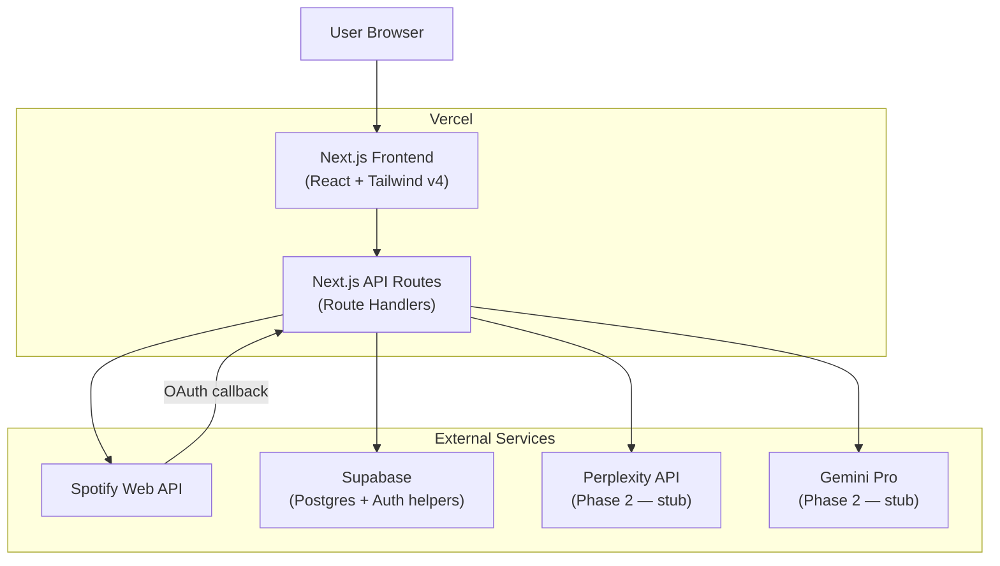

# TeMusc — Architecture Document

> **Version**: 1.0 — Phase 1 (Zero AI Cost)
> **Last updated**: 2026-08-09

---

## 1. Overview

**TeMusc** is a multi-user web platform that connects to Spotify and provides three core modules:

| Module | Purpose |
|---|---|
| **TeMusc OS** | "Operating System" — central dashboard for listening metrics, KPIs, and account overview |
| **TeMusc LAB** | Playlist laboratory — clone, clean, remix, and create experimental playlists safely |
| **TeMusc DISCOVERY** | Guided music exploration — unexplored artists, public playlists, and curator recommendations |

### What TeMusc is NOT
- No DJ features, no live mixing, no crossfade/transition logic.
- No usage of Spotify's DJ API or any mixing APIs.
- Only the standard Spotify Web API for data retrieval and playlist management.

---

## 2. High-Level Architecture



### Data Flow Summary

1. **User** opens TeMusc → lands on marketing/login page.
2. **OAuth** → User clicks "Connect with Spotify" → redirected to Spotify → callback to `/api/auth/callback` → tokens stored in Supabase + HTTP-only cookie session.
3. **TeMusc OS** → Frontend calls `/api/os/*` → API fetches from Spotify + reads/writes snapshots to Supabase → returns enriched data.
4. **TeMusc LAB** → Frontend calls `/api/lab/*` → API reads playlists from Spotify, performs clone/clean logic, writes results back to Spotify + logs in Supabase.
5. **TeMusc DISCOVERY** → Frontend calls `/api/discovery/*` → API cross-references Spotify data (followed artists vs. recently played) → in Phase 2, enriches with Perplexity/Gemini.

---

## 3. Technology Stack

| Layer | Technology | Version | Rationale |
|---|---|---|---|
| **Framework** | Next.js (App Router) | 15.x | Single deployment on Vercel; API routes + SSR + React in one project |
| **UI** | React | 19.x | Bundled with Next.js 15 |
| **Styling** | Tailwind CSS | v4 | CSS-first config, modern utility classes, user preference |
| **Database** | Supabase (Postgres) | latest | Managed Postgres, auth helpers, real-time optional, user preference |
| **Auth** | Custom Spotify OAuth (Authorization Code) | — | Full control over token lifecycle, multi-user support |
| **Hosting** | Vercel | — | Native Next.js deployment, edge functions, user preference |
| **VCS** | GitHub | — | CI/CD with Vercel auto-deploy |
| **AI — Phase 2** | Gemini Pro (stub) | — | Analysis and creative text generation (deferred) |
| **AI — Phase 2** | Perplexity Sonar (stub) | — | Web-enriched discovery recommendations (deferred) |

---

## 4. Spotify Web API Integration

### 4.1 OAuth Flow

**Flow**: Authorization Code (server-side, no PKCE needed since we have a server)

```
User clicks "Connect" 
  → GET https://accounts.spotify.com/authorize?...
  → Spotify login + consent
  → Redirect to /api/auth/callback?code=xxx
  → POST https://accounts.spotify.com/api/token (exchange code)
  → Store access_token + refresh_token in Supabase (encrypted)
  → Set session cookie (HTTP-only, secure)
  → Redirect to /dashboard
```

### 4.2 Required Scopes

| Scope | Used By | Purpose |
|---|---|---|
| `user-read-email` | Auth | Get user email for identification |
| `user-read-private` | Auth | Get user profile (country, display name) |
| `user-top-read` | OS | `GET /me/top/tracks`, `GET /me/top/artists` |
| `user-read-recently-played` | OS | `GET /me/player/recently-played` |
| `playlist-read-private` | LAB | List all user playlists |
| `playlist-read-collaborative` | LAB | Include collaborative playlists |
| `playlist-modify-public` | LAB | Create/modify public playlists |
| `playlist-modify-private` | LAB | Create/modify private playlists |
| `ugc-image-upload` | LAB | Upload custom playlist covers |
| `user-follow-read` | DISCOVERY | List followed artists for cross-reference |

### 4.3 Spotify Client Module (`lib/spotify/client.ts`)

Core functions exposed:

```typescript
// Auth
exchangeCodeForTokens(code: string): Promise<SpotifyTokens>
refreshAccessToken(refreshToken: string): Promise<SpotifyTokens>

// Profile
getUserProfile(accessToken: string): Promise<SpotifyUser>

// Metrics (OS)
getTopTracks(accessToken: string, timeRange: TimeRange, limit?: number): Promise<SpotifyTrack[]>
getTopArtists(accessToken: string, timeRange: TimeRange, limit?: number): Promise<SpotifyArtist[]>
getRecentlyPlayed(accessToken: string, limit?: number): Promise<RecentlyPlayedItem[]>

// Playlists (LAB)
getUserPlaylists(accessToken: string, limit?: number, offset?: number): Promise<SpotifyPlaylist[]>
getPlaylistTracks(accessToken: string, playlistId: string): Promise<SpotifyTrack[]>
createPlaylist(accessToken: string, userId: string, name: string, options?: PlaylistOptions): Promise<SpotifyPlaylist>
addTracksToPlaylist(accessToken: string, playlistId: string, trackUris: string[]): Promise<void>
removeTracksFromPlaylist(accessToken: string, playlistId: string, trackUris: string[]): Promise<void>
uploadPlaylistCover(accessToken: string, playlistId: string, imageBase64: string): Promise<void>

// Discovery
getFollowedArtists(accessToken: string, after?: string): Promise<SpotifyArtist[]>
getRecommendations(accessToken: string, seeds: RecommendationSeeds): Promise<SpotifyTrack[]>
getFeaturedPlaylists(accessToken: string, limit?: number): Promise<SpotifyPlaylist[]>
searchPlaylists(accessToken: string, query: string, limit?: number): Promise<SpotifyPlaylist[]>
```

> **Token Management**: Every API route that touches Spotify will use a middleware/helper that checks token expiry and auto-refreshes before making the call.

---

## 5. Database Schema (Supabase / Postgres)

### 5.1 Tables

#### `users`
```sql
CREATE TABLE users (
  id            UUID PRIMARY KEY DEFAULT gen_random_uuid(),
  spotify_id    TEXT UNIQUE NOT NULL,
  display_name  TEXT,
  email         TEXT,
  country       TEXT,
  avatar_url    TEXT,
  access_token  TEXT NOT NULL,        -- encrypted at rest
  refresh_token TEXT NOT NULL,        -- encrypted at rest
  token_expires_at TIMESTAMPTZ,
  created_at    TIMESTAMPTZ DEFAULT NOW(),
  updated_at    TIMESTAMPTZ DEFAULT NOW()
);
```

#### `metrics_snapshots`
```sql
CREATE TABLE metrics_snapshots (
  id          UUID PRIMARY KEY DEFAULT gen_random_uuid(),
  user_id     UUID REFERENCES users(id) ON DELETE CASCADE,
  captured_at TIMESTAMPTZ DEFAULT NOW(),
  time_range  TEXT NOT NULL,          -- 'short_term' | 'medium_term' | 'long_term'
  top_tracks  JSONB NOT NULL,         -- array of track objects
  top_artists JSONB NOT NULL,         -- array of artist objects
  recently_played JSONB,              -- array of recently played items
  activity_summary JSONB,             -- aggregated activity stats
  ai_summary  TEXT                    -- Phase 2: Gemini-generated text
);
```

#### `playlist_snapshots`
```sql
CREATE TABLE playlist_snapshots (
  id           UUID PRIMARY KEY DEFAULT gen_random_uuid(),
  user_id      UUID REFERENCES users(id) ON DELETE CASCADE,
  playlist_id  TEXT NOT NULL,         -- Spotify playlist ID
  captured_at  TIMESTAMPTZ DEFAULT NOW(),
  name         TEXT,
  description  TEXT,
  track_count  INT,
  tracks       JSONB NOT NULL,        -- full track list snapshot
  is_public    BOOLEAN,
  owner_id     TEXT
);
```

#### `alerts_config`
```sql
CREATE TABLE alerts_config (
  id              UUID PRIMARY KEY DEFAULT gen_random_uuid(),
  user_id         UUID REFERENCES users(id) ON DELETE CASCADE UNIQUE,
  frequency       TEXT DEFAULT 'weekly',  -- 'daily' | 'weekly' | 'monthly'
  metrics_enabled BOOLEAN DEFAULT TRUE,
  discovery_enabled BOOLEAN DEFAULT TRUE,
  lab_enabled     BOOLEAN DEFAULT TRUE,
  created_at      TIMESTAMPTZ DEFAULT NOW(),
  updated_at      TIMESTAMPTZ DEFAULT NOW()
);
```

### 5.2 Row Level Security (RLS)

All tables will have RLS enabled. Since we're using custom Spotify OAuth (not Supabase Auth), we'll use the **Supabase service role key** in API routes and enforce user isolation in application code.

---

## 6. API Endpoints

All endpoints live under `/app/api/` using Next.js Route Handlers.

### 6.1 Auth

| Method | Endpoint | Description |
|---|---|---|
| `GET` | `/api/auth/login` | Redirects to Spotify authorization URL |
| `GET` | `/api/auth/callback` | Handles Spotify OAuth callback, exchanges code, creates/updates user, sets session cookie |
| `POST` | `/api/auth/logout` | Clears session cookie |
| `GET` | `/api/auth/me` | Returns current user profile from session |

### 6.2 TeMusc OS — Metrics

| Method | Endpoint | Description |
|---|---|---|
| `GET` | `/api/os/metrics/overview` | Top tracks + top artists (all time ranges) + recently played + activity aggregates |
| `GET` | `/api/os/metrics/top-tracks?time_range=short_term` | Top tracks for a specific time range |
| `GET` | `/api/os/metrics/top-artists?time_range=short_term` | Top artists for a specific time range |
| `GET` | `/api/os/metrics/recent` | Recently played tracks |
| `POST` | `/api/os/metrics/snapshot` | Capture current metrics snapshot to Supabase |
| `GET` | `/api/os/metrics/history` | List past snapshots |

### 6.3 TeMusc LAB — Playlists

| Method | Endpoint | Description |
|---|---|---|
| `GET` | `/api/lab/playlists` | List all user playlists with metadata |
| `GET` | `/api/lab/playlists/[id]` | Get detailed playlist with tracks |
| `POST` | `/api/lab/clean-playlist` | Clone a playlist with cleaning rules (deduplicate, remove unplayed, etc.) |
| `POST` | `/api/lab/create-themed-playlist` | Create new playlist from seeds + mood params |
| `POST` | `/api/lab/apply-cover` | Upload custom cover image to a playlist |
| `GET` | `/api/lab/analyze/[id]` | Analyze a playlist: duplicates, genre distribution, etc. |

### 6.4 TeMusc DISCOVERY — Exploration

| Method | Endpoint | Description |
|---|---|---|
| `GET` | `/api/discovery/unexplored` | Artists/albums followed but rarely played |
| `GET` | `/api/discovery/public-playlists` | Featured + searched public playlists relevant to user |
| `GET` | `/api/discovery/highlights` | Combined AI-powered recommendations (Phase 2 — returns stubs) |

---

## 7. Frontend Routes

| Route | Module | Description |
|---|---|---|
| `/` | — | Landing page with "Connect with Spotify" CTA |
| `/dashboard` | OS | Main dashboard with metrics overview |
| `/dashboard/history` | OS | Historical snapshots timeline |
| `/lab` | LAB | Playlist library with analysis indicators |
| `/lab/playlist/[id]` | LAB | Detailed playlist view with clean/clone tools |
| `/lab/create` | LAB | Themed playlist creation wizard |
| `/discovery` | DISCOVERY | Exploration hub with three sections |
| `/settings` | — | User preferences, alert config, account |

---

## 8. Project Folder Structure

```
TeMusic/
├── docs/
│   └── architecture.md
├── supabase/
│   └── migrations/
│       └── 001_initial_schema.sql
├── public/
│   ├── favicon.ico
│   └── images/
├── src/
│   ├── app/
│   │   ├── layout.tsx
│   │   ├── page.tsx                  ← landing page
│   │   ├── globals.css
│   │   ├── (auth)/login/page.tsx
│   │   ├── dashboard/
│   │   │   ├── layout.tsx            ← authenticated layout
│   │   │   ├── page.tsx              ← OS dashboard
│   │   │   └── history/page.tsx
│   │   ├── lab/
│   │   │   ├── page.tsx
│   │   │   ├── playlist/[id]/page.tsx
│   │   │   └── create/page.tsx
│   │   ├── discovery/page.tsx
│   │   ├── settings/page.tsx
│   │   └── api/
│   │       ├── auth/{login,callback,logout,me}/route.ts
│   │       ├── os/metrics/{overview,top-tracks,top-artists,recent,snapshot,history}/route.ts
│   │       ├── lab/{playlists,clean-playlist,create-themed-playlist,apply-cover,analyze}/route.ts
│   │       └── discovery/{unexplored,public-playlists,highlights}/route.ts
│   ├── lib/
│   │   ├── spotify/{client.ts, auth.ts, types.ts}
│   │   ├── supabase/{client.ts, queries.ts, types.ts}
│   │   ├── ai/{geminiClient.ts, perplexityClient.ts}  ← STUBS
│   │   ├── session.ts
│   │   └── utils.ts
│   ├── components/
│   │   ├── ui/{Button, Card, Badge, Skeleton, Modal, Chart}.tsx
│   │   ├── layout/{Sidebar, Header, MobileNav}.tsx
│   │   ├── os/{MetricsOverview, TopTracksCard, TopArtistsCard, ActivityChart, KPICards}.tsx
│   │   ├── lab/{PlaylistGrid, PlaylistDetail, CleanPlaylistForm, CreatePlaylistWizard}.tsx
│   │   └── discovery/{UnexploredSection, PublicPlaylistsSection, HighlightsSection}.tsx
│   ├── hooks/{useAuth, useSpotifyData, usePlaylist}.ts
│   └── types/index.ts
├── .env.local.example
├── .gitignore
├── next.config.ts
├── tsconfig.json
├── package.json
└── README.md
```

---

## 9. Key Dependencies

| Package | Version | Purpose |
|---|---|---|
| `next` | ^15.x | Framework |
| `react` / `react-dom` | ^19.x | UI library |
| `tailwindcss` | ^4.x | Styling |
| `@tailwindcss/postcss` | ^4.x | PostCSS plugin for Tailwind v4 |
| `@supabase/supabase-js` | ^2.x | Supabase client |
| `jose` | ^5.x | JWT for sessions (edge-compatible) |
| `recharts` | ^2.x | Charts for metrics visualization |
| `swr` | ^2.x | Data fetching + caching |
| `typescript` | ^5.x | Type safety |

### Phase 2 additions (not installed in Phase 1)
| Package | Purpose |
|---|---|
| `@google/generative-ai` | Gemini API client |

---

## 10. Environment Variables

```bash
# Spotify
SPOTIFY_CLIENT_ID=
SPOTIFY_CLIENT_SECRET=
SPOTIFY_REDIRECT_URI=http://localhost:3000/api/auth/callback

# Supabase
NEXT_PUBLIC_SUPABASE_URL=
SUPABASE_SERVICE_ROLE_KEY=

# Session
SESSION_SECRET=

# AI (Phase 2 — not needed yet)
# GEMINI_API_KEY=
# PERPLEXITY_API_KEY=
```

---

## 11. Auth and Session Strategy

1. **Login**: User clicks "Connect with Spotify" → redirect to Spotify.
2. **Callback**: Exchange `code` for tokens → upsert user in Supabase → sign JWT with `{ userId, spotifyId }`.
3. **Session Cookie**: HTTP-only, Secure, SameSite=Lax cookie containing the JWT.
4. **Authenticated Requests**: API routes verify JWT → load user → auto-refresh Spotify tokens if expired.
5. **Logout**: Clear the cookie.

---

## 12. Phased Implementation Plan

### Phase 1 — MVP (Zero AI Cost)

| Step | What | Priority |
|---|---|---|
| 1.1 | Project scaffolding: Next.js + Tailwind v4 + folder structure | 🔴 Critical |
| 1.2 | Landing page with "Connect with Spotify" | 🔴 Critical |
| 1.3 | Spotify OAuth flow (login → callback → session) | 🔴 Critical |
| 1.4 | Supabase schema + migrations | 🔴 Critical |
| 1.5 | `lib/spotify/client.ts` — full Spotify API wrapper | 🔴 Critical |
| 1.6 | **TeMusc OS**: Dashboard with real metrics | 🔴 Critical |
| 1.7 | **TeMusc OS**: Activity chart + KPI cards | 🟡 High |
| 1.8 | **TeMusc OS**: Snapshot save/history | 🟡 High |
| 1.9 | **TeMusc LAB**: Playlist list + detail view | 🟡 High |
| 1.10 | **TeMusc LAB**: Clean playlist (clone + deduplicate) | 🟡 High |
| 1.11 | **TeMusc LAB**: Create themed playlist from seeds | 🟡 High |
| 1.12 | **TeMusc DISCOVERY**: Unexplored artists | 🟡 High |
| 1.13 | **TeMusc DISCOVERY**: Public playlists | 🟡 High |
| 1.14 | AI stubs: geminiClient + perplexityClient | 🟢 Normal |
| 1.15 | Settings page | 🟢 Normal |
| 1.16 | README + docs + deployment guide | 🟢 Normal |

### Phase 2 — AI Integration (Future, on your request)

| Step | What |
|---|---|
| 2.1 | Replace Gemini stub with real API calls |
| 2.2 | Replace Perplexity stub with real API calls |
| 2.3 | Weekly summary generation in OS |
| 2.4 | AI playlist descriptions in LAB |
| 2.5 | Web-enriched discovery in DISCOVERY |

---

## 13. Design System

### Color Palette (Dark-first)

| Token | Value | Usage |
|---|---|---|
| `--bg-primary` | `#0a0a0f` | Main background |
| `--bg-surface` | `#12121a` | Cards, panels |
| `--bg-surface-hover` | `#1a1a28` | Hover states |
| `--accent-primary` | `#1DB954` | Spotify green — primary CTAs |
| `--accent-secondary` | `#6366f1` | Indigo — TeMusc brand accent |
| `--accent-lab` | `#f59e0b` | Amber — LAB module identity |
| `--accent-discovery` | `#ec4899` | Pink — DISCOVERY module identity |
| `--accent-os` | `#3b82f6` | Blue — OS module identity |
| `--text-primary` | `#f0f0f5` | Primary text |
| `--text-secondary` | `#8888a0` | Muted text |
| `--border` | `#1e1e2e` | Subtle borders |

### Typography
- **Font**: Inter (Google Fonts)
- Headings: `font-semibold`, sizes `text-3xl` down
- Body: `text-sm` / `text-base`

### UI Patterns
- **Glassmorphism** on cards: `backdrop-blur-xl bg-white/5 border border-white/10`
- **Gradient accents**: Module-specific gradient borders/highlights
- **Micro-animations**: Fade-in on mount, hover scale on cards, skeleton loading
- **Sidebar navigation**: Fixed left sidebar with module icons

---

## 14. Security

1. **Tokens**: Stored server-side only (Supabase), never exposed to client
2. **Session**: JWT in HTTP-only, Secure, SameSite=Lax cookie
3. **Supabase**: Service role key only in server-side API routes
4. **Rate Limiting**: Exponential backoff for Spotify API calls
5. **Input Validation**: All user inputs validated in API routes

---

## 15. Open Questions

> [!IMPORTANT]
> Please review these decisions:

1. **Playlist cover uploads**: Phase 1 → user-provided image upload only (no auto-generated collages). Agree?

2. **Snapshot frequency**: Phase 1 → manual only (user clicks "Save Snapshot"). Automatic cron in Phase 2. Agree?

3. **Real-time updates**: Phase 1 → manual refresh (no Supabase Realtime). Agree?
